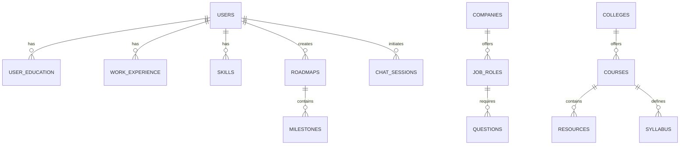
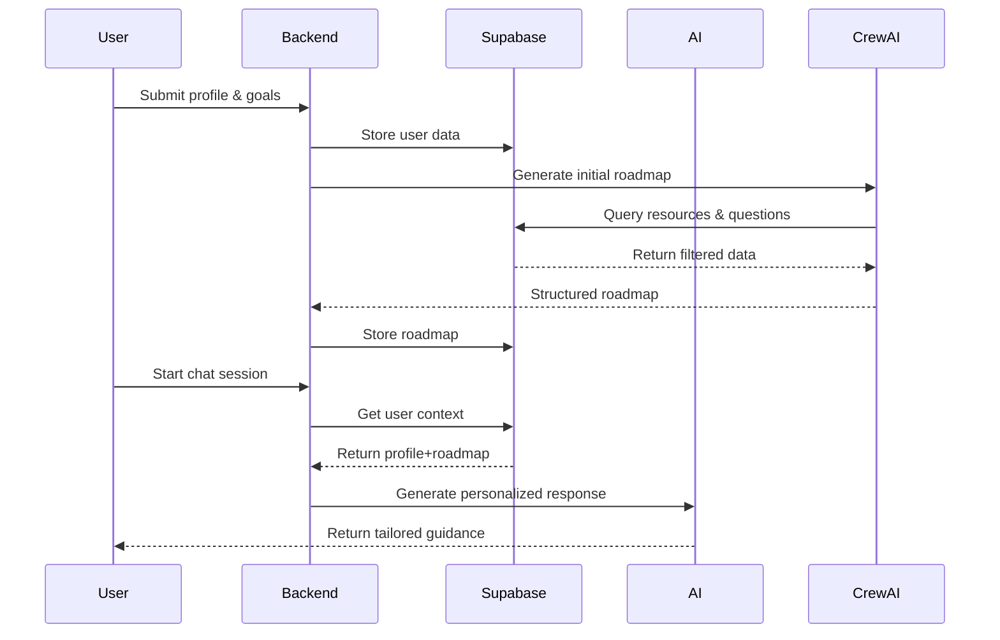

## **1. Core Data Entities & Relationships**


---

## **2. Detailed Schema Design**

### **2.1 User Profile (LinkedIn-like)**
**Table: `users`**
```sql
CREATE TABLE users (
    id UUID PRIMARY KEY,
    email TEXT UNIQUE NOT NULL,
    password_hash TEXT NOT NULL,
    first_name TEXT,
    last_name TEXT,
    headline TEXT,
    summary TEXT,
    avatar_url TEXT,
    location JSONB,
    contact_info JSONB (
        phone TEXT,
        linkedin_url TEXT,
        github_url TEXT
    ),
    career_goals JSONB (
        target_roles TEXT[],
        dream_companies TEXT[],
        target_salary_range NUMERIC[2]
    ),
    preferences JSONB (
        notification_frequency TEXT,
        privacy_settings JSONB
    ),
    created_at TIMESTAMP DEFAULT NOW(),
    updated_at TIMESTAMP DEFAULT NOW()
);
```

**Related Tables:**
```sql
-- Education
CREATE TABLE education (
    id UUID PRIMARY KEY,
    user_id UUID REFERENCES users(id),
    institution TEXT,
    degree TEXT,
    field_of_study TEXT,
    start_date DATE,
    end_date DATE,
    description TEXT
);

-- Work Experience
CREATE TABLE work_experience (
    id UUID PRIMARY KEY,
    user_id UUID REFERENCES users(id),
    company TEXT,
    position TEXT,
    location TEXT,
    start_date DATE,
    end_date DATE,
    description TEXT
);

-- Skills
CREATE TABLE skills (
    id UUID PRIMARY KEY,
    user_id UUID REFERENCES users(id),
    name TEXT,
    proficiency TEXT CHECK (proficiency IN ('Beginner','Intermediate','Advanced','Expert')),
    verified_by JSONB (/* institution/certification details */)
);
```

---

### **2.2 Chat System (ChatGPT-like)**
**Table: `chat_sessions`**
```sql
CREATE TABLE chat_sessions (
    id UUID PRIMARY KEY,
    user_id UUID REFERENCES users(id),
    context JSONB (/* current conversation context */),
    metadata JSONB (
        last_activity TIMESTAMP,
        session_type TEXT CHECK (session_type IN ('career','academic','general'))
    ),
    created_at TIMESTAMP DEFAULT NOW()
);
```

**Table: `chat_messages`**
```sql
CREATE TABLE chat_messages (
    id UUID PRIMARY KEY,
    session_id UUID REFERENCES chat_sessions(id),
    content TEXT,
    role TEXT CHECK (role IN ('user','assistant')),
    metadata JSONB (
        references JSONB [/* array of {type: roadmap|question|resource, id: UUID} */],
        sentiment_score NUMERIC,
        entities TEXT[]
    ),
    created_at TIMESTAMP DEFAULT NOW()
);
```

---

### **2.3 Learning Roadmaps**
**Table: `roadmaps`**
```sql
CREATE TABLE roadmaps (
    id UUID PRIMARY KEY,
    user_id UUID REFERENCES users(id),
    title TEXT,
    description TEXT,
    duration_weeks INT,
    difficulty TEXT CHECK (difficulty IN ('Beginner','Intermediate','Advanced')),
    status TEXT CHECK (status IN ('draft','active','completed')),
    milestones JSONB [/* array of {
        title TEXT,
        description TEXT,
        resources UUID[] REFERENCES resources(id),
        deadline DATE,
        completed BOOLEAN
    } */],
    created_at TIMESTAMP DEFAULT NOW(),
    updated_at TIMESTAMP DEFAULT NOW()
);
```

---

### **2.4 Question Bank (LeetCode-like)**
**Table: `questions`**
```sql
CREATE TABLE questions (
    id UUID PRIMARY KEY,
    type TEXT CHECK (type IN ('mcq','technical','coding','aptitude')),
    difficulty TEXT CHECK (difficulty IN ('Easy','Medium','Hard')),
    tags TEXT[],
    company_id UUID REFERENCES companies(id),
    content JSONB, -- Type-specific content storage
    metrics JSONB (
        success_rate NUMERIC,
        avg_time NUMERIC
    ),
    created_at TIMESTAMP DEFAULT NOW()
);

-- Example content structures:
-- MCQ:
-- {
--   "question": "What is React?",
--   "options": ["Library","Framework","Language","Tool"],
--   "correct_answer": 0
-- }

-- Coding:
-- {
--   "problem": "Reverse a linked list",
--   "test_cases": [...],
--   "solution_template": "..."
-- }
```

**Table: `companies`**
```sql
CREATE TABLE companies (
    id UUID PRIMARY KEY,
    name TEXT UNIQUE,
    industry TEXT,
    hiring_patterns JSONB (
        seasons TEXT[],
        typical_process JSONB
    ),
    created_at TIMESTAMP DEFAULT NOW()
);
```

---

### **2.5 College Resources (LMS-like)**
**Table: `colleges`**
```sql
CREATE TABLE colleges (
    id UUID PRIMARY KEY,
    name TEXT UNIQUE,
    departments TEXT[],
    academic_calendar JSONB,
    created_at TIMESTAMP DEFAULT NOW()
);
```

**Table: `courses`**
```sql
CREATE TABLE courses (
    id UUID PRIMARY KEY,
    college_id UUID REFERENCES colleges(id),
    code TEXT,
    name TEXT,
    credits INT,
    syllabus JSONB [/* array of {
        week INT,
        topics TEXT[],
        learning_outcomes TEXT[]
    } */],
    resources JSONB [/* array of {
        type TEXT CHECK (type IN ('lecture','assignment','reference')),
        url TEXT,
        description TEXT
    } */],
    created_at TIMESTAMP DEFAULT NOW()
);
```

---

## **3. Integration Matrix**

| Entity         | Relationships                                                                 | Use Cases                                                                 |
|----------------|-------------------------------------------------------------------------------|---------------------------------------------------------------------------|
| User Profile ↔ | - Linked to roadmaps<br>- Connected to chat history<br>- Mapped to education | Personalization engine for recommendations                               |
| Chat System ↔  | - References roadmaps<br>- Links to questions/resources<br>- Tracks context  | Context-aware career guidance with memory persistence                    |
| Roadmaps ↔     | - Contains college resources<br>- Includes practice questions                | Unified learning path combining academic & career needs                  |
| Questions ↔    | - Tagged with companies<br>- Categorized by difficulty                       | Targeted interview preparation based on dream companies                  |
| College ↔      | - Syllabus mapped to roadmaps<br>- Resources linked to courses               | Academic requirement tracking with career relevance mapping              |

---

## **4. Key Integration Features**

### **4.1 Contextual Chat Assistance**
```python
def generate_chat_response(user_id, message):
    # Get user context
    user = get_user(user_id)
    roadmap = get_current_roadmap(user_id)
    college_courses = get_current_courses(user_id)
    
    # Build context-aware prompt
    prompt = f"""
    User Profile: {user.summary}
    Current Roadmap: {roadmap.title}
    Active Courses: {college_courses}
    Conversation History: {chat_history}
    
    New Message: {message}
    """
    
    # Get AI response
    return gemini.generate(prompt)
```

### **4.2 Smart Roadmap Generator**
```python
def generate_roadmap(user_id):
    user = get_user(user_id)
    target_jobs = user.career_goals->>'target_roles'
    current_courses = get_current_courses(user_id)
    
    # Get relevant resources
    resources = supabase.rpc('get_relevant_resources', {
        'target_jobs': target_jobs,
        'courses': current_courses
    })
    
    # Generate timeline
    return crewai.execute({
        'user_data': user,
        'resources': resources,
        'academic_timeline': get_academic_calendar(user.college_id)
    })
```

### **4.3 Adaptive Question Bank**
```sql
-- Get company-specific questions with matching skill requirements
SELECT * FROM questions
WHERE company_id IN (
    SELECT UNNEST(career_goals->'dream_companies') 
    FROM users WHERE id = 'user_uuid'
)
AND tags && (
    SELECT skills->>'name' FROM users WHERE id = 'user_uuid'
)
ORDER BY difficulty DESC;
```

---

## **5. Data Flow Architecture**


---

This schema provides:
1. **Comprehensive Data Tracking**: All aspects of user's academic & career journey
2. **Contextual Relationships**: Deep linking between different data entities
3. **Personalization Foundation**: Data structure enables recommendation engines
4. **Temporal Tracking**: Historical progress monitoring for both academics & career prep
5. **Scalable Architecture**: Properly normalized tables with JSONB for flexibility